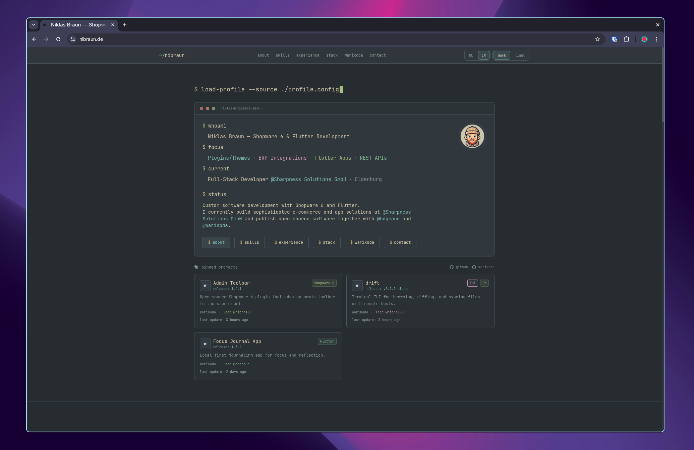

# nibraun.de – Personal Resume Website

Personal portfolio website in a TUI/terminal-inspired style.


## Screenshot



## Features

- **Terminal aesthetics** – Inspired by classic CLI interfaces
- **Everforest color palette** – Dark and light mode with system preference detection
- **Static deployment** – Ready-to-serve files without server-side logic
- **Responsive design** – Mobile-first layout built with Tailwind CSS
- **DE/EN i18n** – Language toggle with browser and `localStorage` fallback
- **Section intro typewriter** – Command-style intros before the main section content appears
- **Scroll animations** – Subtle section reveal effects
- **Accessibility** – Semantic HTML, ARIA labels, and keyboard-friendly interactions
- **GitHub project meta** – Release versions and recent updates for project cards
- **Local cache** – GitHub metadata is cached client-side via `localStorage`

## Tech Stack

- HTML5
- Tailwind CSS (CLI build)
- Vanilla JavaScript
- `translations.js` for i18n
- `projects.js` for project data
- `github-project-meta.js` for GitHub release/update metadata
- `section-intro.js` for section intro typewriter behavior
- Everforest color palette

## Color Palette

The design uses the [Everforest](https://github.com/sainnhe/everforest) palette:

| Variable | Dark | Light | Usage |
|----------|------|-------|-------|
| `--terminal-bg` | `#2d353b` | `#fdf6e3` | Background |
| `--terminal-accent` | `#a7c080` | `#8da101` | Accent color, links |
| `--terminal-green` | `#a7c080` | `#8da101` | Shopware, success |
| `--terminal-cyan` | `#83c092` | `#35a77c` | Flutter, info |
| `--terminal-purple` | `#d699b6` | `#df69ba` | Frontend |
| `--terminal-amber` | `#dbbc7f` | `#dfa000` | Backend |
| `--terminal-red` | `#e67e80` | `#f85552` | Dev workflow |

## Development

```bash
npm install
npm run build
```

For Tailwind during development:

```bash
npm run dev:css
```

The following files are required for deployment:

- `index.html`
- `translations.js`
- `projects.js`
- `github-project-meta.js`
- `section-intro.js`
- `dist/tailwind.css`
- `img/`

## Links

- **Live**: [nibraun.de](https://nibraun.de)
- **GitHub**: [github.com/nibra180](https://github.com/nibra180)
- **WariKoda**: [github.com/WariKoda](https://github.com/WariKoda)
- **Employer**: [Sharpness Solutions GmbH](https://sharpness.de)

## License

This repository is publicly visible, but it is not licensed for free use, reproduction, modification, or redistribution.

All rights reserved.
