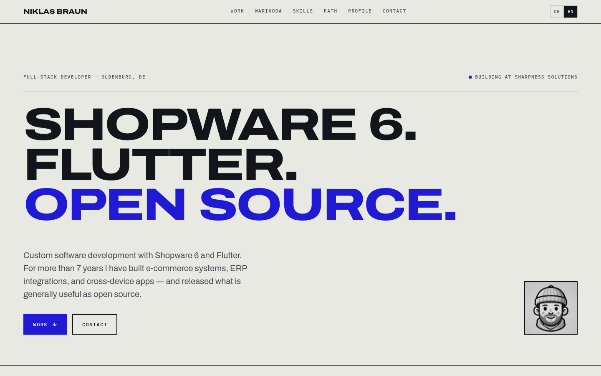

# nibraun.de – Personal Portfolio

Personal portfolio website for Niklas Braun, built as a showcase for published software.


## Screenshot



## Design

“BRAUN: datasheet” takes its cues from classic Braun product design: a mid-grey
shell, light component panels, recessed bezels, calibrated scales, technical
labelling, and one functional orange signal. The work index is the signature
instrument, turning live GitHub releases into indicator lights and `pushed_at`
values into comparable gauge positions. A deliberately data-free CSS measurement
field gives the hero an atmospheric technical counterweight without pretending
to show live telemetry.

## Features

- **Work instrument** – Published repositories with live release lights and logarithmic last-push gauges
- **Career scale** – The path section presents the timeline as a calibrated device scale
- **One considered theme** – Light only, built from shell, panel, and recessed bezel surfaces
- **DE/EN i18n** – Language toggle backed by `?lang=` and `localStorage`
- **Static deployment** – Ready-to-serve files, no server-side logic
- **No runtime dependencies** – Vanilla JavaScript only
- **Responsive** – Mobile-first, headlines reflow rather than shrink on small screens
- **Accessible** – Semantic HTML, ARIA labels, visible focus, `prefers-reduced-motion` respected
- **Local cache** – GitHub metadata cached client-side for six hours

## Tech Stack

- HTML5
- Tailwind CSS v4 (CSS-first configuration in `src/tailwind.css`)
- Vanilla JavaScript
- Instrument Sans and Martian Mono
- `translations.js` for i18n
- `projects.js` for the work index entries
- `github-project-meta.js` for GitHub release and update metadata

## Palette

Raw values live on `--c-*` and are exposed to Tailwind through `@theme inline`.

| Token | Value | Usage |
|---|---|---|
| `--c-shell` | `#d6d3cb` | Device shell and page background |
| `--c-panel` | `#eeece7` | Light component and section surface |
| `--c-bezel` | `#c4c0b6` | Recessed controls, tags, and gauge beds |
| `--c-fg` | `#1a1917` | Primary labelling |
| `--c-fg-dim` | `#6c675e` | Secondary labelling |
| `--c-rule` | `#bdb9ae` | Internal joints and gauge ticks |
| `--c-signal` | `#e8590c` | Indicator lights, needles, and active graphics |
| `--c-signal-text` | `#9a3412` | Accessible signal-coloured text |
| `--c-on-signal` | `#1a1917` | Foreground on signal fills |
| `--c-invert-bg` | `#1a1917` | Inverted component background |
| `--c-on-invert` | `#e6e3dc` | Foreground on inverted components |

**`--c-signal` is never a text colour.** It is reserved for fills and graphics;
links and signal labels use `--c-signal-text`. `.on-fill` only rewrites
foreground roles to `currentColor`, keeping fills independent from their content.

## Development

```bash
npm install
npm run build     # one-off minified build
npm run dev       # watch mode
npm run serve     # static server on :8000
```

Files required for deployment:

- `index.html`
- `translations.js`
- `projects.js`
- `github-project-meta.js`
- `dist/tailwind.css`
- `img/`

## Links

- **Live**: [nibraun.de](https://nibraun.de)
- **GitHub**: [github.com/nibra180](https://github.com/nibra180)
- **WariKoda**: [github.com/WariKoda](https://github.com/WariKoda)
- **Employer**: [Sharpness Solutions GmbH](https://sharpness.de)

## License

This repository is publicly visible, but it is not licensed for free use, reproduction, modification, or redistribution.

All rights reserved.
